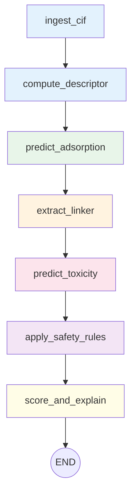

# MOFScreen-Agent

**Simulation-in-the-loop screening for environmentally compatible Metal-Organic Frameworks (MOFs).**

MOFScreen-Agent is an evaluation-type multi-agent system that screens user-provided MOF structures (CIF files) for both adsorption performance and environmental safety. It combines pre-trained machine learning models for benzene/toluene adsorption prediction with aquatic toxicity assessment and metal safety rules to produce a comprehensive screening report.

This tool was developed for the Yan Lab (South China Agricultural University) to support research on environmentally responsible MOF design. The core models are based on Sine Coulomb Matrix descriptors for adsorption and Morgan fingerprint-based Random Forest models for toxicity prediction.

The system is designed as an **evaluation agent** — users upload CIF files and receive screening results. It does not generate or design new MOFs.

## Quick Start

```bash
# 1. Clone the repo
git clone https://github.com/<OWNER>/MOFScreen-Agent.git
cd MOFScreen-Agent

# 2. Create venv
python -m venv .venv
# Windows:
.venv\Scripts\activate
# Linux/macOS:
source .venv/bin/activate

# 3. Install deps
pip install -r requirements.txt

# 4. Download models (see MODELS_DOWNLOAD.md)

# 5. Configure paths
cp configs/paths.yaml.example configs/paths.yaml
# Edit configs/paths.yaml with your local model paths

# 6. Validate
python validate_models.py

# 7. Run web UI
streamlit run app.py
```

## Installation (detailed)

### Configure Model Paths

Copy `configs/paths.yaml.example` to `configs/paths.yaml` and edit with your local model paths:

```yaml
adsorption_models:
  benzene_model: "<YOUR_MODEL_PATH>/benzene_tuned_pipeline.pkl"
  toluene_model: "<YOUR_MODEL_PATH>/toluene_xgb_model.pkl"
  # ...

toxicity_models:
  model_dir: "<YOUR_MODEL_PATH>/trained_toxicity_models"
```

See [MODELS_DOWNLOAD.md](MODELS_DOWNLOAD.md) for how to obtain model files.

Verify all model files are accessible:
```bash
python -c "import yaml; cfg=yaml.safe_load(open('configs/paths.yaml')); print('OK')"
```

## Usage

### 1. Streamlit Web UI

```bash
streamlit run app.py
```

Upload CIF files through the sidebar, click "Run Screening", and view results including:
- Summary table with adsorption, toxicity, and safety metrics
- Pareto scatter plot (adsorption vs toxicity)
- Per-MOF detailed explanations
- CSV download

### 2. Command-Line Batch Screening

```bash
python examples/batch_screen.py --cif-dir /path/to/cif/files --out results.csv
```

### 3. Python API

```python
from agent.graph import screening_app

result = screening_app.invoke({
    "cif_path": "/path/to/structure.cif",
    "warnings": [],
    "errors": [],
})

print(result["recommendation"])  # "recommend" / "borderline" / "reject"
print(result["final_score"])     # 0.0 - 10.0
print(result["explanation"])     # Natural language interpretation
```

## Architecture



| Node | Description | Tool |
|------|-------------|------|
| ingest_cif | Parse CIF path, extract MOF ID | — |
| compute_descriptor | CIF → SCM eigenvalues | matminer SineCoulombMatrix |
| predict_adsorption | SCM → benzene/toluene uptake (mg/g) | sklearn RF / XGBoost |
| extract_linker | CIF → metals + linker SMILES (3-level degradation) | pymatgen + known linkers DB |
| predict_toxicity | SMILES → 4 aquatic toxicity endpoints | RF + Morgan fingerprints |
| apply_safety_rules | Metal blacklist + ECHA PMT criteria | RDKit descriptors |
| score_and_explain | Weighted scoring + LLM/rule-based explanation | LangGraph + optional LLM |

LLM is **only** used in `score_and_explain` for natural language interpretation. All numerical predictions are deterministic. When no API key is configured, a rule-based fallback generates the explanation.

## Known Limitations

1. **Adsorption models** are trained only for benzene and toluene at 298K, 1 bar (GCMC conditions)
2. **Linker extraction** relies on a database of 15 known linkers. Complex or novel linkers fall back to Level 3 (metals-only assessment)
3. **Toxicity models** are screening-level RF models (test R² = 0.45–0.74 depending on endpoint)
4. **SCM dimension** — MOFs with very few/many atoms require zero-padding/truncation, triggering applicability domain warnings
5. **XGBoost version** — Toluene model requires xgboost >= 3.2.0

## Citations

- **AquaticTox:** Yan Lab. "Implementing Comprehensive Machine Learning Models of Multispecies Toxicity Assessment to Improve Chemical Regulation." *Environment & Health*, 2024. GitHub: [YanLabAI/AquaTox](https://github.com/YanLabAI/AquaTox)
- **MOF Adsorption Models:** Yan Lab, South China Agricultural University. Sine Coulomb Matrix descriptors with Random Forest (benzene) and XGBoost (toluene) trained on CoRE MOF 2019 DDEC subset with GCMC-generated labels.

## License

Research use only. Contact Yan Lab for licensing inquiries.

## Acknowledgments

Developed in collaboration with the Yan Lab, South China Agricultural University.
