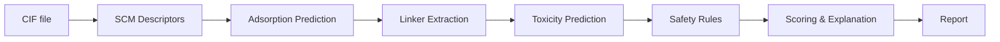

# MOFScreen-Agent

**Simulation-in-the-loop screening for environmentally compatible Metal-Organic Frameworks (MOFs).**

MOFScreen-Agent is an evaluation-type multi-agent system that screens user-provided MOF structures (CIF files) for both adsorption performance and environmental safety. It combines pre-trained machine learning models for benzene/toluene adsorption prediction with aquatic toxicity assessment and metal safety rules to produce a comprehensive screening report.

This tool was developed for the Yan Lab (South China Agricultural University) to support research on environmentally responsible MOF design.

The system is designed as an **evaluation agent** — users upload CIF files and receive screening results. It does not generate or design new MOFs.

## Quick Start

```bash
# 1. Clone the repo
git clone https://github.com/andy88836/Safe_mats_demo.git
cd Safe_mats_demo/safe_mats_demo

# 2. Create and activate virtual environment
python -m venv .venv
# Windows:
.venv\Scripts\activate
# Linux/macOS:
source .venv/bin/activate

# 3. Install dependencies
pip install -r requirements.txt

# 4. Download models (see MODELS_DOWNLOAD.md)

# 5. Configure paths
cp configs/paths.yaml.example configs/paths.yaml
# Edit configs/paths.yaml with your local model paths

# 6. Validate models
python validate_models.py

# 7. Run tests
python -m pytest tests/ -v

# 8. Launch web UI
streamlit run app.py
```

## Project Structure

```
safe_mats_demo/
├── agent/                          # LangGraph pipeline core
│   ├── graph.py                    # 7-node state machine assembly
│   ├── nodes.py                    # Node functions (ingest → score)
│   ├── prompts.py                  # LLM prompt templates
│   └── state.py                    # ScreeningState TypedDict
│
├── tools/                          # Standalone tool modules
│   ├── descriptors.py              # CIF → SCM eigenvalues (matminer)
│   ├── adsorption.py               # SCM → benzene/toluene uptake (RF/XGBoost)
│   ├── linker_extraction.py        # CIF → metal + linker SMILES (3-level)
│   ├── toxicity.py                 # SMILES → 4 aquatic toxicity endpoints (RF)
│   └── safety_rules.py             # Metal blacklist + PMT pre-filter
│
├── configs/                        # All configuration (YAML)
│   ├── paths.yaml.example          # Template for model path config
│   ├── thresholds.yaml             # Scoring weights & PMT criteria
│   ├── metals.yaml                 # Black/grey/white metal lists
│   └── known_linkers.yaml          # 15 known MOF linkers database
│
├── app.py                          # Streamlit web UI
├── examples/batch_screen.py        # CLI batch screening
├── validate_models.py              # Model performance validation
├── train_toxicity_models.py        # Retrain toxicity models from SDF data
├── requirements.txt                # Pinned dependencies
│
├── tests/                          # 20 unit + integration tests
│   ├── fixtures/                   # IRMOF-1.cif, ZIF-8.cif, NaCl.cif
│   ├── test_descriptors.py         # SCM computation (5 tests)
│   ├── test_adsorption.py          # Prediction range & schema (4 tests)
│   ├── test_linker.py              # Linker extraction levels (3 tests)
│   ├── test_safety.py              # Metal & PMT rules (6 tests)
│   └── test_pipeline.py            # End-to-end integration (2 tests)
│
├── docs/                           # Technical documentation
│   ├── architecture.md             # Pipeline design & data flow
│   ├── scoring.md                  # Scoring formula & thresholds
│   ├── model_validation_report.md  # R²/MAE validation results
│   ├── e2e_test_log.md             # End-to-end test output log
│   └── known_issues.md             # Documented limitations
│
├── MODELS_DOWNLOAD.md              # How to obtain model files
├── CITATION.cff                    # Citation metadata
└── LICENSE                         # MIT License
```

## Installation

### Prerequisites

- Python 3.11+
- 6 pre-trained model files (`.pkl`, not included in repo — see [MODELS_DOWNLOAD.md](MODELS_DOWNLOAD.md))

### Step 1: Environment Setup

```bash
cd safe_mats_demo
python -m venv .venv

# Windows
.venv\Scripts\activate

# Linux / macOS
source .venv/bin/activate

pip install -r requirements.txt
```

**Key version locks** (model serialization compatibility):
- `scikit-learn==1.8.0`
- `xgboost==3.2.0`

### Step 2: Model Files

You need 6 model files. See [MODELS_DOWNLOAD.md](MODELS_DOWNLOAD.md) for details.

| Model | Input | Output |
|-------|-------|--------|
| `rf_only_seed8_best_model_benzene.pkl` | 520-dim SCM eigenvalues | Benzene uptake (mg/g) |
| `best_model_toluene.pkl` + `scaler_toluene.pkl` | 584-dim SCM eigenvalues | Toluene uptake (mg/g) |
| `rf_lc50.pkl` | Morgan FP + descriptors | LC50 fish toxicity |
| `rf_lc50dm.pkl` | Morgan FP + descriptors | LC50 daphnia toxicity |
| `rf_igc50.pkl` | Morgan FP + descriptors | IGC50 tetrahymena toxicity |
| `rf_ibc50.pkl` | Morgan FP + descriptors | IBC50 vibrio toxicity |

### Step 3: Configure Paths

```bash
cp configs/paths.yaml.example configs/paths.yaml
```

Edit `configs/paths.yaml` — fill in the absolute paths to your model files:

```yaml
adsorption_models:
  benzene_model: "/your/path/to/rf_only_seed8_best_model_benzene.pkl"
  toluene_model: "/your/path/to/best_model_toluene.pkl"
  toluene_scaler: "/your/path/to/scaler_toluene.pkl"
  benzene_target_dim: 520
  toluene_target_dim: 584

toxicity_models:
  model_dir: "/your/path/to/trained_toxicity_models"
```

### Step 4: Validate

```bash
# Check model loading and metrics
python validate_models.py
# Expected: Benzene R²=0.7855, Toluene R²=0.9819

# Run all tests
python -m pytest tests/ -v
# Expected: 20 passed
```

## Usage

### 1. Streamlit Web UI

```bash
streamlit run app.py
```

Open the browser (default `http://localhost:8501`):
1. Upload one or more `.cif` files via the sidebar
2. (Optional) Select LLM provider for natural language explanations
3. Click **Run Screening**
4. View results: summary table, Pareto plot, per-MOF detail cards
5. Download results as CSV

### 2. Command-Line Batch Screening

```bash
python examples/batch_screen.py --cif-dir /path/to/cif/files --out results.csv
```

Output: a CSV with columns for MOF ID, metals, linker, adsorption, toxicity, safety tier, score, and recommendation.

### 3. Python API

```python
from agent.graph import screening_app

result = screening_app.invoke({
    "cif_path": "/path/to/structure.cif",
    "warnings": [],
    "errors": [],
})

print(result["recommendation"])  # "recommend" / "borderline" / "reject"
print(result["final_score"])     # 0.0 - 10.0
print(result["explanation"])     # Natural language interpretation
```

## Architecture

### Pipeline Overview



### 7-Node LangGraph Pipeline

| Node | Function | Tool / Method |
|------|----------|---------------|
| `ingest_cif` | Parse CIF path, extract MOF ID | pathlib |
| `compute_descriptor` | CIF → SCM eigenvalues (520d / 584d) | matminer `SineCoulombMatrix` |
| `predict_adsorption` | Eigenvalues → benzene & toluene uptake (mg/g) | sklearn RF / XGBoost |
| `extract_linker` | CIF → metals + linker SMILES | pymatgen + known_linkers.yaml |
| `predict_toxicity` | SMILES → 4 aquatic toxicity endpoints (-log mol/L) | RF + Morgan fingerprints |
| `apply_safety_rules` | Metal blacklist + ECHA PMT pre-filter | RDKit descriptors |
| `score_and_explain` | Weighted score + explanation | Rule-based / optional LLM |

### Scoring Formula

```
final_score = 0.4 × adsorption_score + 0.3 × safety_score + 0.3 × toxicity_score
```

| Score Range | Recommendation |
|-------------|----------------|
| >= 7.0 | recommend |
| 5.0 – 7.0 | borderline |
| < 5.0 | reject |

See [docs/scoring.md](docs/scoring.md) for full details.

### Linker Extraction (3-Level Degradation)

| Level | Strategy | Result |
|-------|----------|--------|
| 1 | Exact formula match (incl. deprotonated variants) | Name + SMILES |
| 2 | Ratio-based scoring (threshold >= 0.5) | Name + SMILES |
| 3 | Unable to assess | Metals only; toxicity skipped |

### Toxicity Model Confidence

| Endpoint | Organism | CV R² | Confidence |
|----------|----------|-------|------------|
| LC50 | *P. promelas* (fish) | 0.649 | high |
| LC50DM | *D. magna* | 0.597 | medium ⚡ |
| IGC50 | *T. pyriformis* | 0.691 | high |
| IBC50 | *V. fischeri* | 0.480 | low ⚠️ |

### LLM Integration

LLM is **only** used in `score_and_explain` for natural language interpretation. All numerical predictions are deterministic. Supported providers:
- OpenAI (`OPENAI_API_KEY`)
- Qwen/DashScope (`DASHSCOPE_API_KEY`)
- **No API key required** — a rule-based fallback always generates the explanation.

## Model Performance

| Model | Test R² | Test MAE | Training Data |
|-------|---------|----------|---------------|
| Benzene RF (tuned, rs=8) | 0.7855 | 17.77 mg/g | CoRE MOF 2019 DDEC + GCMC |
| Toluene XGBoost (rs=42) | 0.9819 | 11.43 mg/g | CoRE MOF 2019 DDEC + GCMC |

See [docs/model_validation_report.md](docs/model_validation_report.md) for full validation results.

## Known Limitations

1. **Adsorption models** trained for benzene and toluene only (298K, 1 bar GCMC conditions)
2. **Linker extraction** relies on 15 known linkers; novel linkers fall back to Level 3
3. **Toxicity models** are screening-level (CV R² = 0.48–0.69 depending on endpoint)
4. **SCM dimension** — MOFs with very few/many atoms need zero-padding/truncation, triggering applicability domain warnings
5. **XGBoost version** — toluene model requires `xgboost >= 3.2.0`; older versions produce incorrect predictions (R² = -2.81)
6. **CIF compatibility** — tested with P1 and Fm-3m space groups; some CIF formatting edge cases may cause parsing errors

## Citations

- **AquaticTox:** Yan Lab. "Implementing Comprehensive Machine Learning Models of Multispecies Toxicity Assessment to Improve Chemical Regulation." *Environment & Health*, 2024. [GitHub](https://github.com/YanLabAI/AquaTox)
- **MOF Adsorption Models:** Yan Lab, South China Agricultural University. Sine Coulomb Matrix descriptors with Random Forest (benzene) and XGBoost (toluene) trained on CoRE MOF 2019 DDEC subset.

## License

MIT License. See [LICENSE](LICENSE).

## Acknowledgments

Developed in collaboration with the Yan Lab, South China Agricultural University.
